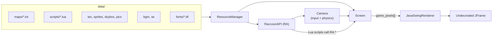
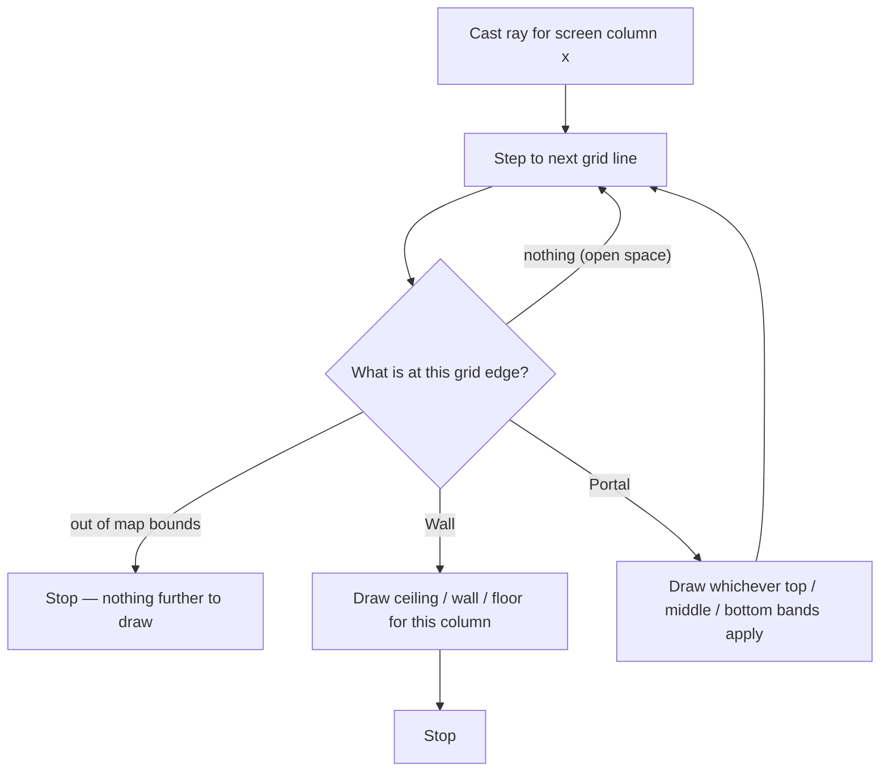

# Raccoon Engine

**A retro 2.5D sector/portal raycasting engine, written in Java and scripted in Lua, with a browser-based level editor.**

This document is a full technical and design reference for the [`rsanche4/Raccoon-Engine`](https://github.com/rsanche4/Raccoon-Engine) repository, written after reading every source file, the sample assets, and the project's complete commit history. At the time of writing, the repository has no README of its own — this fills that gap.

> If you just cloned this repo and want the short version: it's a Wolfenstein/DOOM/Build‑Engine‑style raycaster (grid map, sectors with independent floor/ceiling heights, portals between rooms, billboarded sprites), rendered in software across multiple CPU threads, with an embedded pure‑Java Lua interpreter for game logic and a from‑scratch canvas-based map editor. Jump to [Getting Started](#getting-started) to run it.

## At a Glance

| | |
|---|---|
| **Core language** | Java (engine) · Lua (game scripts) · JavaScript/HTML/CSS (editor) |
| **Engine size** | ~2,100 lines across 15 files (`RaccoonEngineV2/src/raccoon`) |
| **Editor size** | ~1,460 lines (`RaccoonMapEditor/`) — no build step, no dependencies |
| **Java version** | 21 (`JavaSE-21`, per the Eclipse project settings) |
| **Scripting runtime** | [LuaJ 3.0.2](https://sourceforge.net/projects/luaj/) — a pure‑Java Lua interpreter, no native bindings |
| **Default resolution** | 640×480 internal buffer, upscaled to the native display |
| **Rendering** | CPU, multithreaded, column‑by‑column sector/portal raycasting |
| **Build system** | None — Eclipse `.project`/`.classpath` only (a plain `javac`/`java` invocation also works, see below) |
| **License** | MIT — © 2025 Rafael Sanchez |
| **History** | 134 commits, single author, dating back to a July 2025 Python prototype |

---

## Table of Contents

- [Overview](#overview)
- [Origins and Philosophy](#origins-and-philosophy)
- [Repository Layout](#repository-layout)
- [Getting Started](#getting-started)
- [Architecture](#architecture)
  - [The Game Loop](#the-game-loop)
  - [The World Model](#the-world-model)
  - [The Renderer](#the-renderer)
  - [Camera, Movement and Collision](#camera-movement-and-collision)
  - [Palette, Shading and Lighting](#palette-shading-and-lighting)
  - [Display Scaling and Windowing](#display-scaling-and-windowing)
  - [Resource Loading](#resource-loading)
  - [Audio](#audio)
- [Scripting with Lua and RaccoonAPI](#scripting-with-lua-and-raccoonapi)
  - [The Script Lifecycle](#the-script-lifecycle)
  - [Regular Scripts and Sprite Behavior Scripts](#regular-scripts-and-sprite-behavior-scripts)
  - [RaccoonAPI Reference](#raccoonapi-reference)
  - [State Persistence](#state-persistence)
  - [Extending the API](#extending-the-api)
- [The Map Format](#the-map-format)
- [Assets and Conventions](#assets-and-conventions)
- [The Map Editor](#the-map-editor)
  - [Editor Workflow](#editor-workflow)
  - [Projects vs Exported Maps](#projects-vs-exported-maps)
  - [Manhattan Partitioning](#manhattan-partitioning)
  - [Editor Gotchas](#editor-gotchas)
- [Design Tradeoffs](#design-tradeoffs)
- [Known Limitations and Unfinished Areas](#known-limitations-and-unfinished-areas)
- [Controls Reference](#controls-reference)
- [Project History](#project-history)
- [License](#license)

---

## Overview

Raccoon Engine is a from-scratch 2.5D game engine in the lineage of *Wolfenstein 3D*, *DOOM*, and the Build Engine (*Duke Nukem 3D*, *Shadow Warrior*). The world is a 2D grid of **sectors** (rooms), each with its own floor and ceiling height, connected by **portals** that let the camera see — and, optionally, walk — from one sector into the next. Every frame, one ray is cast per screen column outward from the player, marched through the grid, and used to draw that column's slice of ceiling, wall, and floor. Objects and characters are flat, always-facing-the-camera **sprites**.

The repository has two independent parts that talk to each other only through a shared file format:

- **`RaccoonEngineV2`** — the Java engine itself: the renderer, physics, resource loading, and a Lua scripting bridge called `RaccoonAPI`.
- **`RaccoonMapEditor`** — a standalone browser page for drawing levels and exporting them to the engine's map format.

There is no game shipped with the engine — `RaccoonEngineV2/data/` contains a minimal sample (one room, one script) whose only job is to prove the pipeline works. Building an actual game means replacing that folder's contents and writing Lua.

---

## Origins and Philosophy

The git history goes back further than the current code suggests, and it's worth knowing because it explains several of the engine's design choices.

The project's first commits (mid-July 2025) are small standalone Python scripts working out projection and texturing math — nothing playable yet, just the geometry. Within days that became "v1": a Python engine paired with a Python level editor. From there the history takes a detour that never made it into the current engine at all: a real attempt at **Binary Space Partitioning** — the actual algorithm DOOM used — with commits literally titled `Finished BSP!` and `added partial bspgen`. Shortly after, there's a commit titled `decided to switch to cplusplus`, which also didn't stick.

What did stick was a pivot away from BSP and toward the **sector/portal model** the engine uses today — architecturally closer to the Build Engine than to DOOM's BSP tree — followed eventually by a full rewrite into Java, which is the "V2" preserved in `RaccoonEngineV2/`. An earlier README (later deleted from the repo, but recoverable from git history) put the reasoning this way, in the author's own words:

> *"I had already been working on a game engine that used raycasting instead since 2022. I was able to finish it, but I felt like it was too limited still. Raycasting was great, but I could accomplish a lot more. I wanted to create my own 3D engine, but I did not want to go full rasterization, so I decided to opt in for something simpler. It was here where I remembered one of my favorite childhood games, DOOM."*

That same document — written by Rafael Sanchez, who studied Machine Learning rather than game development — described the project's goals as **transparency and educational value**: an engine simple enough that its whole rendering pipeline can be read and understood end to end, deliberately kept CPU-side and low-resolution as much as an aesthetic choice as a performance one, general enough that (despite the boomer-shooter framing) it could be — and per that document, had been — used for non-FPS and even 2D projects, since the sector/sprite/scripting model doesn't actually require a first-person camera.

That original document is no longer part of the repository and some of its specifics (an `ReApi`/`REAPI` naming scheme, a `config.cfg` file, a crouch mechanic) describe an earlier stage of the project and don't match the current `RaccoonEngineV2` source — this document describes what's actually in the repo today, correcting for that drift where the two disagree. See [Project History](#project-history) for more of the timeline.

---

## Repository Layout

```text
Raccoon-Engine/
├── LICENSE                        MIT, © 2025 Rafael Sanchez
├── RaccoonEngineV2/                The engine
│   ├── .classpath, .project        Eclipse project files (JavaSE-21)
│   ├── .settings/
│   ├── bin/                        Compiled .class output (checked into git)
│   ├── lib/
│   │   └── luaj-jse-3.0.2.jar      The only external dependency
│   ├── src/raccoon/                 15 Java files, ~2,100 lines — see table below
│   └── data/                       Sample game content (replace this for your own game)
│       ├── bgm/        sample_bgm.wav
│       ├── fonts/       system_font.ttf
│       ├── maps/        map.txt
│       ├── pics/        sample_pic.png
│       ├── scripts/     init.lua      (required — see Resource Loading)
│       ├── se/          sample_se.wav
│       ├── skybox/      default_sky.png
│       ├── sprites/     sample_sprite.png
│       └── tex/         tex.png, wood.png
└── RaccoonMapEditor/                Browser-based level editor
    ├── raccoon_editor.html          Open this directly — no build step
    ├── editor.js                    ~1,200 lines, vanilla JS, no framework
    ├── editor_style.css
    └── tex/                         The editor's own texture-preview folder
        └── tex.png
```

### Engine source files

| File | Lines | Role |
|---|---:|---|
| `Main.java` | 75 | Entry point; owns the fixed-timestep game loop and the shared thread pool |
| `Table.java` | 125 | Precomputed constants: the color palette, the light-shading table, per-column ray angles, display-scaling lookup tables |
| `Screen.java` | 390 | The renderer core — per-column raycasting, portal traversal, wall/floor/ceiling/sky/sprite drawing |
| `Camera.java` | 371 | Keyboard/mouse input handling and player physics/collision |
| `RaccoonAPI.java` | 605 | The entire Lua-facing API surface, exposed to scripts as the global `RA` |
| `ResourceManager.java` | 220 | Loads and validates everything under `data/` |
| `Sector.java` | 57 | Data model for a room: floor/ceiling heights, textures, bounding box |
| `Sound.java` | 75 | WAV playback (implemented, but not yet wired to any scripting call — see [Audio](#audio)) |
| `JavaSwingRenderer.java` | 52 | The only current `Renderer` implementation (AWT/Swing) |
| `Portal.java` | 40 | Data model for a shared, three-band, optionally-solid edge between two sectors |
| `Wall.java` | 23 | Data model for a solid grid-edge segment |
| `Sprite.java` | 32 | Data model for a billboarded entity |
| `Texture.java` | 12 | A simple indexed-pixel image (used for textures, sprites, skybox, and baked font glyphs) |
| `Event.java` | 17 | A tiny `(script_name, priority)` pair used to order active scripts |
| `Renderer.java` | 7 | A one-method interface abstracting the final pixel blit |

---

## Getting Started

**Prerequisites:** JDK 21. There is no other dependency besides the one bundled jar (`lib/luaj-jse-3.0.2.jar`).

### Option A — Eclipse

The repo ships Eclipse project metadata (`.project`, `.classpath`), so `File → Open Projects from File System… → RaccoonEngineV2` and Run should work immediately with no extra configuration.

### Option B — command line

This exact sequence was verified against the repository as of this writing:

```bash
cd RaccoonEngineV2
javac -cp "lib/luaj-jse-3.0.2.jar" -d bin $(find src -name "*.java")
java  -cp "bin:lib/luaj-jse-3.0.2.jar" raccoon.Main
```

*(On Windows, use `;` instead of `:` as the classpath separator.)*

A few things worth knowing before you run it:

- **Run it from inside `RaccoonEngineV2/`.** `ResourceManager` looks for `data/` as a path relative to the working directory, not relative to the source tree.
- **It needs a real display.** This was verified directly: in a headless environment (no X server / no display attached), the engine throws a `HeadlessException` immediately, because `Table`'s static initializer queries the screen size via AWT's `Toolkit` at class-load time, before anything else runs. It cannot run over SSH without X forwarding, in a plain Docker container, or in CI as-is.
- **The window is borderless and sized to your full screen.** `JavaSwingRenderer` creates an undecorated `JFrame` matching your detected display resolution — there's no windowed/fullscreen toggle, and no in-engine minimize button; you're relying entirely on your OS's own window-switching (Alt-Tab or equivalent).
- **There's no packaged distributable.** No installer, no runnable fat jar, no launch script — the two commands above are the whole build process.

---

## Architecture



### The Game Loop

`Main` starts a single background thread (`game_loop_thread`) running a classic fixed-timestep accumulator loop targeting `MAX_FPS = 60`:

```java
while (running) {
    long now = System.nanoTime();
    delta += (now - lastTime) / nsPerFrame;
    lastTime = now;
    boolean updated = false;
    while (delta >= 1) {
        update();       // Screen.update() + Camera.update()
        delta--;
        updated = true;
    }
    if (updated) render();
}
```

If the loop falls behind, `update()` can run more than once before the next `render()` — standard "catch up on logic, don't catch up on drawing" behavior. `update()` itself does two things every tick: advance `Screen` (which performs the entire raycast and fills the pixel buffer) and advance `Camera` (input sampling and physics).

A single `ExecutorService` — a fixed thread pool sized to `Runtime.getRuntime().availableProcessors()` — is created once in `Main` and reused every frame for the parallel per-column raycasting work described below. `Table.init()` runs once before the game loop starts, precomputing the palette, the light-shading table, and the per-column projection math, all of which depend on the (compile-time-fixed) internal resolution.

### The World Model

The map lives on an integer X/Z grid. `Screen.verticals` is a flat array sized `(map_width + 1) × (map_height + 1) × 2` — every unit grid cell has two addressable slots, one per axis-aligned edge orientation, indexed via `makeWallIndex(x, z, orientation)`. Each slot holds one of three things:

- **Nothing (`null`)** — open space. The ray simply keeps marching through it. A map doesn't need every edge defined; only edges you actually want to block or bend the ray need a `Wall` or `Portal` entry.
- **A `Wall`** — a solid, single-textured boundary belonging to exactly one sector. The ray stops here.
- **A `Portal`** — a shared boundary between exactly two sectors, with up to three independently textured bands (bottom / middle / top, to cover a floor-height step, a ceiling-height step, or both) and an explicit `solid` flag. The ray does **not** stop — it continues into the neighboring sector, which is what lets you see (and, if not solid, walk) through a chain of connected rooms.

A `Sector` stores a single floor height and a single ceiling height (both in world units, capped at 512), textures/brightness/tiling for each, and an axis-aligned bounding box computed automatically from whichever walls and portals reference it while the map loads. Finding "which sector is the player standing in" (`updatePlayerSector`) is a linear scan doing a simple point-in-bounding-box test — which is exact for every sector the shipped editor generates (they're always literal rectangles by construction, see [Manhattan Partitioning](#manhattan-partitioning)), but is worth knowing if you ever hand-author a `map.txt` with a non-rectangular sector shape: the *bounding box*, not the true outline, is what location lookups use.

### The Renderer

For each of the 640 (default) screen columns, `Screen` computes a perspective-correct ray angle from a precomputed arctangent offset table (this avoids the fisheye distortion a naive linear angle-sweep would cause), then steps the ray through the grid using a horizontal/vertical grid-line intersection test — the same family of algorithm usually called DDA (Digital Differential Analysis) in raycaster tutorials. At each step it looks up `verticals[]` at the current cell:



Once a column hits a `Wall`, it draws the sector's ceiling from the top of the screen down to the wall, the wall itself (perspective-projected and clipped to the screen), and the sector's floor from the wall down to the bottom — all in one pass, using a perpendicular-distance projection to avoid fisheye distortion. Floor and ceiling texturing is computed per-pixel: for each scanline below/above the wall, the engine reverse-projects to recover that pixel's world-space distance, then samples the tile texture at the corresponding world coordinate — the classic "floor casting" technique. A `depth_buffer` records the sampled distance at every pixel as it's drawn.

The entire per-column loop is parallelized: each column is submitted as a task to the shared thread pool, and a `CountDownLatch` blocks the main thread until all columns finish before the frame continues on to sky, sprites, and any script/console drawing. (The commit history shows this wasn't the first attempt — an earlier round of threading was abandoned as "too much overhead," with the current multithreaded-by-column approach arriving later as the version that stuck.)

**Sprites** are handled as a separate pass after walls: each sprite is transformed into camera space, culled if behind the camera, and its screen-space footprint is computed from `sprite_length / distance`. Rather than sorting sprites by distance (a painter's algorithm, which breaks on overlapping sprites), every candidate pixel is tested against the same `depth_buffer` the wall pass wrote — a true per-pixel depth test, so overlapping sprites and sprite/wall occlusion resolve correctly regardless of draw order. Each sprite also picks one of 8 pre-rendered directional frames based on the angle between its own facing direction and the vector to the player, the same "rotated sprite" trick DOOM used for its actors.

### Camera, Movement and Collision

`Camera` does double duty as both an AWT input listener (`KeyListener`, `MouseListener`, `MouseMotionListener`, `MouseWheelListener`) and the per-frame physics update.

**Input abstraction:** a `KEY_MAP` of roughly 70 friendly string names — every letter and digit, `f1`–`f12`, common punctuation and navigation keys, plus four synthetic pseudo-keys for the two mouse buttons and the wheel directions — maps to AWT virtual key codes. Held/just-pressed ("once") state is snapshotted once per frame. This is the exact table `RA:inputGetKeyStatus(is_once, keyname)` reads from, so Lua scripts query input the same way the engine itself does.

**Mouselook:** on the first click, the engine captures the mouse — hides the cursor and uses `java.awt.Robot` to recenter it every frame while accumulating the delta, the standard technique for unbounded FPS mouselook in a windowed AWT app.

**Movement:** WASD, with collision checked independently on each axis (so sliding along a wall works correctly), arrow keys and mouse-X for turning, and mouse-Y / Page Up / Page Down for pitch, clamped to a fixed range. Because pitch is implemented by shifting the on-screen horizon line rather than truly rotating the ray directions, looking up and down is a **faked** effect — accurate near the horizon, increasingly sheared the further you look — exactly the technique Build Engine games used, not a true 3D camera rotation.

**Vertical movement** has two modes, toggled via `RA:playerSetFly()` / `RA:playerSetWalk(...)`:
- *Walking* — gravity, a jump impulse when standing on the floor, and a sine-wave view-bob while moving on the ground.
- *Flying ("jetpack")* — Space/Ctrl move straight up/down, gravity is ignored entirely.

**Collision** blocks horizontal movement if the destination point falls outside any sector, if it crosses into a different sector through a `Portal` explicitly marked solid, if the destination sector's floor is at or above the player's current eye height, if its ceiling is at or below it, or if it overlaps a sprite with a nonzero `collision_radius`. There's no separate "max step height" constant — stepping up onto a slightly raised floor works because it's still below eye level; a floor raised past your eyes blocks you. Sprite collision is **horizontal only** — a sprite's own height is never checked, so you can't walk over or under something with a collision radius regardless of vertical position.

### Palette, Shading and Lighting

`Table.PALETTE` is a fixed 256-entry table built to match the classic **xterm 256-color terminal palette**: the 16 base ANSI colors, a 6×6×6 RGB color cube (216 colors), and a 24-step grayscale ramp. Every image the engine loads — wall/floor textures, sprites, the skybox, "pics," even font glyphs rasterized from TrueType — is quantized at load time to the nearest of these 256 colors by brute-force nearest-neighbor search in RGB space. Fully transparent pixels become a `-1` sentinel meaning "no pixel here," not a color.

Lighting is a precomputed light-diminishing table in the Doom/Build tradition, not real-time math. There are 32 discrete brightness levels: level 15 is a texture's original color, levels 0–14 fade toward black, levels 16–31 fade toward white — and each faded result is re-snapped to the nearest of the same 256 palette entries, so lit surfaces always stay on-palette rather than drifting into arbitrary RGB values. Every sector face, wall, portal band, and sprite carries its own brightness, authored as a friendly `0.0`–`1.0` float in the map file or via the API and rescaled internally to the 0–31 table index.

### Display Scaling and Windowing

All rendering happens into a fixed internal buffer — `Main.GAME_WID × Main.GAME_HEI`, 640×480 by default, hardcoded constants — of palette indices. At blit time, `JavaSwingRenderer` nearest-neighbor-scales that buffer up into an undecorated, full-native-resolution `JFrame`, preserving aspect ratio and centering with letterbox/pillarbox bars as needed. This is what gives the engine its "chunky pixel" retro look independent of the player's actual monitor resolution, and it's also why the resolution is a single global knob: changing `GAME_WID`/`GAME_HEI` in `Main.java` requires a recompile, and because `Camera.retina_dist` (the projection focal length) defaults to `GAME_WID / 2.0`, it should be adjusted to match or the field of view will look stretched.

### Resource Loading

Everything lives under a `data/` folder (relative to the working directory), one dedicated subfolder per asset type — see [Assets and Conventions](#assets-and-conventions) for the full table. Loading is deliberately fail-fast: a missing required subfolder, a file with the wrong extension inside one of these subfolders, a missing `init.lua`, or a skybox/sprite image with the wrong pixel dimensions all throw a descriptive `RuntimeException` immediately at startup rather than failing silently or later.

A `.rpk` single-file asset-pack path exists as a placeholder (`ResourceManager.packRPK()` / `unpackRPK()`) for a future distributable bundle format, but both methods literally return the string `"Implement me!"` — right now, shipping a game means shipping the raw `data/` folder as-is.

Fonts are handled unusually: `.ttf` files aren't rendered as vector text at runtime. At load time, every printable ASCII character (32–126) is rasterized once through AWT's font renderer into its own small palette-quantized glyph bitmap, cached by `'<char>_<fontfile>'`. This baked bitmap-font system is what currently powers the built-in on-screen debug console — see `RA:systemDebug` / `RA:systemLog` below.

### Audio

`Sound.java` is a complete, working WAV player — one-shot or looping playback via `javax.sound.sampled`, with a perceptual volume curve mapped onto the clip's decibel gain control. But nothing in `RaccoonAPI` currently calls it: every `audio*` method is an explicit stub (see the API reference below). Music and sound-effect files can be dropped into `data/bgm` / `data/se` and are loaded and validated at startup, but there is currently no scripting call that actually plays them.

---

## Scripting with Lua and RaccoonAPI

### The Script Lifecycle

This is the single most important thing to understand before writing a script for this engine, and it's easy to miss by skimming the code:

**There is no persistent Lua state between frames.** Every single frame, for every entry in `ResourceManager.active_scripts` — sorted ascending by priority — the engine creates a **brand-new** LuaJ `Globals` environment, re-parses that script's raw source text from scratch, and calls it, passing the script's current index in the list as its sole vararg. The exact same thing happens separately for every sprite's `behavior_script`. Nothing is a coroutine; nothing is "resumed." A script's `local` variables are gone by the next frame, full stop.

```java
for (int i = 0; i < ResourceManager.active_scripts.size(); i++) {
    Globals globals = JsePlatform.standardGlobals();
    globals.set("RA", CoerceJavaToLua.coerce(api_instance));
    LuaValue chunk = globals.load(ResourceManager.level_data.get(active_scripts.get(i).script_name), "");
    chunk.call(LuaValue.valueOf(i));
}
```

Two practical consequences follow directly from this:

1. **A script that never removes itself will run forever, from the top, every frame.** This is why the shipped `init.lua` ends by calling `RA:scriptEnd(script_index)` on itself — without that line, it would reload the map and reset the player's position 60 times a second.
2. **Anything a script needs to remember has to go through `RA:storeSet` / `RA:storeGet`** (backed by a plain Java `HashMap` that *does* persist for the life of the process), or be re-derived from state the engine hands back each frame — which is exactly what the sprite behavior-script varargs are for.

There's also a real performance implication worth flagging: re-lexing and re-parsing Lua source text every frame, for every active script and every sprite, is repeated work. It's fine at the scale the sample content implies, but it's a genuine architectural cost to keep in mind if a project grows to dozens of simultaneously active scripted entities.

### Regular Scripts and Sprite Behavior Scripts

There are two kinds of script, distinguished only by how they're registered and what they receive as `...`:

**A regular script** is registered with `RA:scriptAdd(script_name, priority)` and receives just its own index in the active-scripts list:

```lua
-- data/scripts/init.lua (shipped with the repo, in full)
local script_index = ...

RA:playerSetPosition(2, 2, 2, 0)
RA:playerSetWalk(2, 0, 0)
RA:worldLoadMap("map.txt")
RA:worldSetSkybox("default_sky.png", 0.5)
RA:scriptEnd(script_index)
```

`init.lua` is special only in that `ResourceManager` auto-registers it at priority 1 on startup — every game needs one, and it's the natural place to position the player, load the first map, and set the skybox before immediately deregistering itself.

**A sprite's behavior script** is attached via `RA:entityUpsertSprite(...)` and runs once per sprite per frame, receiving nine positional values — the sprite's complete current authored state:

```lua
local x, y, z, length, brightness, name, id, radius, dir = ...
```

Because there's no persistent state and no shipped example of a behavior script in the repo, here's an illustrative one, showing the pattern in practice — a sprite that paces back and forth by remembering its direction in the store and re-upserting its own position each frame:

```lua
-- Illustrative example — not shipped in the repository.
local x, y, z, length, brightness, name, id, radius, dir = ...

local key = "patrol_dir_" .. id
local going_right = RA:storeGet(key)
if going_right == nil then going_right = true end

local speed = 0.02
local new_x = x
if going_right then
    new_x = x + speed
    if new_x > 10 then going_right = false end
else
    new_x = x - speed
    if new_x < 2 then going_right = true end
end

RA:storeSet(key, going_right)
RA:entityUpsertSprite(id, new_x, y, z, length, brightness, name, "guard.lua", radius, dir)
```

### RaccoonAPI Reference

`RaccoonAPI` is exposed to every script as the global `RA`, using Lua's colon call syntax (`RA:methodName(args)`), because it's a coerced instance of an ordinary Java object rather than a plain table. It has **45 public methods**; **10 of them are explicit stubs** that return or contain the literal string `"Implement me!"` rather than doing anything yet.

#### System

| Call | Status | Description |
|---|---|---|
| `RA:systemDebug(is_debug)` | Implemented | Toggles the on-screen debug console |
| `RA:systemLog(msg, system_call)` | Implemented | Logs to stdout, and to the on-screen console if enabled |
| `RA:systemWorldTime()` | Implemented | Returns the real wall-clock timestamp as a string |
| `RA:systemStartTime()` | Implemented | Seconds since the engine started |
| `RA:systemGetMaxFPS()` | Implemented | Returns `Main.MAX_FPS` |
| `RA:systemGetFrameNumber()` | Implemented | Returns the current frame counter |
| `RA:systemQuit()` | Implemented | Hard-exits the JVM (`System.exit(0)`) |

#### Script management

| Call | Status | Description |
|---|---|---|
| `RA:scriptAdd(script_name, priority)` | Implemented | Registers a `.lua` file to run every frame, in priority order |
| `RA:scriptEnd(script_index)` | Implemented | Removes a script by its list index |
| `RA:scriptEndByName(script_name)` | Implemented | Removes a script by filename |

#### Audio — all stubbed

| Call | Status | Description |
|---|---|---|
| `RA:audioPlayBGM(bgm_name, loop, volume)` | **Stub** | No-op; returns `"Implement me!"` |
| `RA:audioChangeBGMVol(volume)` | **Stub** | No-op; returns `"Implement me!"` |
| `RA:audioStopBGM()` | **Stub** | No-op; returns `"Implement me!"` |
| `RA:audioPlaySE(se_name, loop, volume)` | **Stub** | No-op; returns `"Implement me!"` |
| `RA:audioChangeSEVol(se_name, volume)` | **Stub** | No-op; returns `"Implement me!"` |
| `RA:audioStopSE(se_name)` | **Stub** | No-op; returns `"Implement me!"` |

#### World

| Call | Status | Description |
|---|---|---|
| `RA:worldSetSkybox(skyboxname, brightness)` | Implemented | Sets the active skybox image and brightness |
| `RA:worldSetSkyboxOffset(offset)` | Implemented | Horizontally offsets the skybox scroll |
| `RA:worldGetSectorCountLimit()` | Implemented | Returns the current sector array size cap |
| `RA:worldSetSectorCountLimit(lim)` | Implemented | Changes the sector array size cap (call before loading a map) |
| `RA:worldLoadMap(mapname)` | Implemented | Parses and loads a `.txt` map — see [The Map Format](#the-map-format) |
| `RA:worldSetPortalCollision(sector_a, sector_b, is_solid)` | Implemented | Toggles whether a portal blocks movement, at runtime |
| `RA:worldChangeSectorVals(is_floor, sector_id, texture, brightness, tiled, skip_texture)` | Implemented | Edits a sector's floor or ceiling at runtime |
| `RA:worldChangeVerticalVals(x, z, is_vertical, texture, skip, brightness, tiled, portal_band)` | Implemented | Edits a wall's texture, or one band (0=bottom/1=middle/2=top) of a portal, at runtime |

#### Entity

| Call | Status | Description |
|---|---|---|
| `RA:entityUpsertSprite(id, x, y, z, length, brightness, spritename, behavior_script, collision_radius, direction_rad)` | Implemented | Creates a sprite, or updates it if `id` already exists |
| `RA:entityRemoveSprite(id)` | Implemented | Removes a sprite |

#### Player

| Call | Status | Description |
|---|---|---|
| `RA:playerGetPosition(dimension)` | Implemented | `0`=x, `1`=y, `2`=z |
| `RA:playerSetPosition(x, y, z, dir)` | Implemented | Teleports the player and sets facing direction |
| `RA:playerGetSector()` | Implemented | Returns the player's current sector ID |
| `RA:playerSetMoveSpeed(speed)` | Implemented | |
| `RA:playerSetTurnSpeed(speed)` | Implemented | |
| `RA:playerSetPitchSpeed(speed)` | Implemented | |
| `RA:playerSetFly()` | Implemented | Enables jetpack (noclip-style free vertical flight) |
| `RA:playerSetWalk(floor_offset, bob_speed, bob_amount)` | Implemented | Disables jetpack; configures walking feel |
| `RA:playerSetGravity(g)` | Implemented | |
| `RA:playerGetGravity()` | Implemented | |

#### Input

| Call | Status | Description |
|---|---|---|
| `RA:inputSetMouseSensitivity(sens)` | Implemented | |
| `RA:inputGetKeyStatus(is_once, keyname)` | Implemented | Queries the same `KEY_MAP` table described in [Controls Reference](#controls-reference) |

#### Store (state persistence)

| Call | Status | Description |
|---|---|---|
| `RA:storeSet(key, value)` | Implemented | Writes to a global, flat, process-lifetime key/value store |
| `RA:storeGet(key)` | Implemented | Reads from it |
| `RA:storeSaveGameState()` | **Stub** | No persistence to disk yet |
| `RA:storeLoadGameState()` | **Stub** | No persistence to disk yet |

#### UI — stubbed

| Call | Status | Description |
|---|---|---|
| `RA:uiDraw()` | **Stub** | No general-purpose drawing call yet |
| `RA:uiText()` | **Stub** | No on-screen text call for game UI yet (distinct from the built-in debug console) |

#### User

| Call | Status | Description |
|---|---|---|
| `RA:userExampleFunc()` | Implemented (placeholder) | A labeled example showing where to add your own API methods |

### State Persistence

`RA:storeSet`/`RA:storeGet` is a single flat, global, string-keyed map for the entire game — there's no per-script or per-sprite namespacing, so avoiding key collisions between unrelated scripts (the illustrative patrol example above namespaces its own key by sprite `id` for exactly this reason) is left to the author. Saving that state to disk between play sessions is not yet implemented (`storeSaveGameState`/`storeLoadGameState` are stubs), so right now all state is lost when the game closes.

### Extending the API

Because `RA` is just a coerced instance of a normal Java object, adding a new callable is a source-level change: add a public method to `RaccoonAPI.java`, recompile, and call it as `RA:yourNewMethod(...)` from Lua. `userExampleFunc()` exists purely as a labeled example of this pattern. There's no plugin system or dynamic loading — extending the engine's scripting surface always means editing and recompiling `RaccoonAPI.java` itself, which lines up with the "engine source is available for reference and advanced customization" approach described in [Origins and Philosophy](#origins-and-philosophy).

---

## The Map Format

Maps are plain text files in `data/maps/`, loaded via `RA:worldLoadMap("filename.txt")`. The format is four bracket-headed sections, whitespace-delimited fields per line. **Section order matters** even though the parser doesn't explicitly validate it: `[SIZE]` must come first (it allocates the grid array everything else writes into), `[SECTORS]` must come before `[PORTALS]` (portal parsing sizes its collision matrix from however many sectors exist so far). Getting the order wrong produces a null-pointer or array-bounds exception, not a friendly error message.

#### `[SIZE]` — one line

| # | Field | Meaning |
|--:|---|---|
| 0 | width | Grid width in units (max 512) |
| 1 | height | Grid height in units (max 512) |

#### `[SECTORS]` — one line per sector

| # | Field | Type | Meaning |
|--:|---|---|---|
| 0 | id | int | Sector ID, referenced by walls, portals, and API calls |
| 1 | floor_height | double | 0–512 |
| 2 | ceil_height | double | 0–512 |
| 3 | floor_texture | string | Filename in `data/tex/` |
| 4 | floor_brightness | double | 0.0–1.0 |
| 5 | floor_tiled | double | Tiling/repeat factor |
| 6 | floor_skip_texture | bool | If `true`, the floor isn't drawn at all |
| 7 | ceil_texture | string | |
| 8 | ceil_brightness | double | |
| 9 | ceil_tiled | double | |
| 10 | ceil_skip_texture | bool | If `true`, the ceiling isn't drawn (falls through to sky/void) |

#### `[WALLS]` — one line per wall segment

| # | Field | Type | Meaning |
|--:|---|---|---|
| 0–3 | x1, z1, x2, z2 | double | Endpoints — must share either their X or their Z coordinate (grid-aligned only) |
| 4 | sector_id | int | The sector this wall faces |
| 5 | texture | string | |
| 6 | brightness | double | |
| 7 | tiled | double | |
| 8 | skip_texture | bool | If `true`, invisible but still solid |

A wall line can span multiple grid cells at once — the loader stamps the same texture across every unit cell along the span.

#### `[PORTALS]` — one line per shared edge

| # | Field | Type | Meaning |
|--:|---|---|---|
| 0–3 | x1, z1, x2, z2 | double | Shared edge, grid-aligned |
| 4, 5 | sector_a, sector_b | int | The two sectors this portal connects |
| 6–9 | bottom_texture, brightness, tiled, skip | | Drawn where one sector's floor is higher than the other's |
| 10–13 | middle_texture, brightness, tiled, skip | | Drawn across the full opening (a grate, window, force field, etc.) |
| 14–17 | top_texture, brightness, tiled, skip | | Drawn where one sector's ceiling is lower than the other's |
| 18 | solid | bool | Whether the player can physically pass through — independent of visibility |

#### Worked example

This is the complete sample map shipped in `data/maps/map.txt` — a single 20×15 room with a floor, no ceiling (skipped, so the sky shows through), and four wood-textured walls:

```text
[SIZE]
20 15
[SECTORS]
0 0 4 tex.png 0.5 1 false tex.png 0.5 0 true
[WALLS]
0 0 19 0 0 wood.png 0.5 0 false
19 0 19 14 0 wood.png 0.5 0 false
0 14 19 14 0 wood.png 0.5 0 false
0 0 0 14 0 wood.png 0.5 0 false
[PORTALS]
```

#### Constraints worth knowing

- Coordinates must be non-negative; height and size values are capped at `LIMIT_MAP_COORD = 512`.
- Walls and portals must be axis-aligned — no diagonal or angled geometry is possible at the format level.
- Any grid edge left undefined is simply open space; the ray marches through it rather than erroring, so an unenclosed area won't crash the engine — it just lets the camera see straight through to the edge of the map in that direction.
- `MAX_NUM_SECTORS` defaults to 1024 (an allocated array size, adjustable pre-load via `RA:worldSetSectorCountLimit`).

---

## Assets and Conventions

| Folder | Format | Constraint | Purpose |
|---|---|---|---|
| `data/maps/` | `.txt` | See [The Map Format](#the-map-format) | Level geometry |
| `data/scripts/` | `.lua` | `init.lua` is mandatory | Game logic; see [Scripting](#scripting-with-lua-and-raccoonapi) |
| `data/tex/` | `.png` | No enforced size (samples ship at 32×32) | Wall/floor/ceiling tile textures |
| `data/sprites/` | `.png` | **Width must equal 8 × height** | Billboarded entities — 8 baked directional frames per sheet |
| `data/skybox/` | `.png` | **Must be exactly 4 × `GAME_WID` by `GAME_HEI`** (2560×480 by default) | A 4-panel horizontal strip, scrolled based on player yaw |
| `data/fonts/` | `.ttf` | — | Rasterized at load into per-glyph indexed bitmaps for ASCII 32–126; currently powers the debug console |
| `data/bgm/` | `.wav` | — | Looping background music (loaded and validated, but not yet playable — see [Audio](#audio)) |
| `data/se/` | `.wav` | — | One-shot sound effects (same caveat) |
| `data/pics/` | `.png` | — | General images, loaded like textures but not yet wired to any specific draw call — likely intended for menus/UI once `RA:uiDraw`/`RA:uiText` are implemented |

Every loaded image — regardless of source — is palette-quantized to the nearest of the engine's fixed 256 colors at load time (see [Palette, Shading and Lighting](#palette-shading-and-lighting)); there's no way to bypass this and use arbitrary true-color art.

---

## The Map Editor

`RaccoonMapEditor` is a single static page — `raccoon_editor.html`, `editor.js`, `editor_style.css` — with no build step, no framework, and no dependencies. Open the HTML file directly in a browser. Its green-on-black, monospace, terminal-style look matches the engine's own retro sensibility.

### Editor Workflow

The canvas is a top-down 2D view of the map's X/Z plane. Right-drag to pan, scroll to zoom (toward the cursor). Rooms are drawn one axis-aligned segment at a time — each new segment automatically snaps to horizontal or vertical relative to the previous point, so any freehand shape you draw stays rectilinear ("Manhattan") by construction — and a shape is closed by clicking back on its own starting vertex.

Each closed shape becomes a room with its own floor/ceiling height, texture, brightness, and tiling, plus **per-side** wall/portal settings (north/south/east/west, relative to that shape's own bounding box) — including a top/middle/bottom three-band texture set and a `solid` toggle, mirroring the map format directly.

A single, separate **world boundary** shape is required (the "Define World Boundary" button) and must be drawn so its own bounding box touches the origin, `(0, 0)` — the editor will refuse it otherwise. This becomes the map's outer edge and supplies the (simpler, single-texture) perimeter wall settings.

### Projects vs Exported Maps

The editor works with two distinct file formats:

- **`project.json`** (New/Load/Save Project) — the raw drawn shapes and world boundary, fully editable. This is the *only* format the editor can read back in.
- **`map.txt`** (Download Map.txt) — the one-way export the engine actually consumes, produced only after running the partitioning step below.

Keep the `.json` project file if you'll want to reopen and edit the layout later — the exported `.txt` alone can't be loaded back into the editor.

### Manhattan Partitioning

This is the editor's cleverest piece, and it's what turns freeform hand-drawn rooms into the strict non-overlapping grid the engine's map format requires, without asking the author to manually align everything themselves:

1. **Collect every distinct X and every distinct Z coordinate** used anywhere on the map — every shape's edges, plus the world boundary.
2. **Sort them** and build the full grid of cells from every pair of adjacent coordinates (a coordinate-compression / arrangement construction).
3. **Classify each cell** by testing its center point against every hand-drawn shape with a point-in-polygon test; a cell inside a shape inherits that shape's floor/ceiling settings, a cell inside none of them ("void") falls back to the world boundary's own settings.
4. **Classify every resulting unit edge**: if it lies on the world boundary, it becomes an outer `Wall` using that boundary's per-side texture; if exactly two cells share it, it becomes a `Portal` between them, with textures and solidity resolved by matching the edge back to whichever hand-drawn edge originally covered that segment (falling back to an untextured, non-solid `black.png` portal if no authored edge covers it).

The payoff: you can draw an L-shaped room, or two rooms that only partially overlap in one axis, and the editor derives the minimal shared grid and the correct internal portal seams for you — no manual snapping required.

The corollary worth knowing: because the grid is a single global cross-product of *every* coordinate anywhere on the map, two completely unrelated shapes that happen to share an X or Z value will inject a grid line — and therefore an extra seam — into each other's geometry too. This is an inherent property of the technique, not a bug, but it's worth keeping in mind if you need precise, minimal-sector layouts.

### Editor Gotchas

- **Default placeholder texture names aren't shipped as real files.** The config panel defaults to names like `floor.png`, `ceiling.png`, `wall.png`, and `black.png` — none of which exist in `RaccoonEngineV2/data/tex/` (which only ships `tex.png` and `wood.png`). Leaving a field at its default and exporting will reference a texture the engine can't find.
- **The editor previews textures from its own local `tex/` folder**, separate from the engine's runtime `data/tex/` — the two need to be kept in sync manually as you add art.
- **Only bounding-box-aligned edges get an individual config section.** For a complex (e.g. L-shaped) room, only the sides that touch that shape's own outermost north/south/east/west extent are individually configurable in the panel; other edges fall back to the default (untextured, non-solid) treatment unless they happen to coincide with the world boundary.

---

## Design Tradeoffs

Several of the constraints above are deliberate, not accidental, and the commit history and the recovered earlier README both shed light on the reasoning:

- **Grid-aligned geometry only, no diagonals.** This trades DOOM's arbitrary wall angles for speed, and — as the recovered README puts it — for sidestepping the epsilon/precision problems that DOOM's real BSP system had to contend with. Walls snap cleanly, intersection math stays simple, at the cost of curved or diagonal spaces.
- **No rooms directly above rooms.** The same "one floor height, one ceiling height, found by a simple lookup" simplicity that kept DOOM fast. True room-over-room needs a different data structure entirely (and DOOM never had it either).
- **Faked pitch instead of a true 3D camera.** Keeps the entire renderer a 2D (X/Z-plane) ray problem. A truly tilting camera would mean re-deriving the whole projection rather than just shifting where the horizon lands on screen.
- **Billboarded sprites with 8 baked directional frames**, rather than real 3D actor geometry — most of the visual benefit of a 3D character at a tiny fraction of the cost, the same trick DOOM, Duke3D, and Build Engine games all leaned on.
- **CPU, multithreaded, indexed-color rendering, rather than GPU/shaders.** The commit history shows genuine back-and-forth here — threading was tried, abandoned as "too much overhead," and later reintroduced as the version that stuck. At a 640×480 internal resolution with a fixed 256-color palette, a handful of CPU threads is enough, and it keeps the entire pipeline auditable end to end, which matches the project's stated educational/transparency goal.
- **Full Lua re-interpretation every frame, instead of persistent coroutines.** Radically simpler on the engine side — no coroutine lifecycle to manage, no risk of a script's stale state outliving a hot-reloaded map — at the cost of repeated parsing overhead and the "everything durable goes through `RA:storeSet`" discipline described above.

---

## Known Limitations and Unfinished Areas

**Explicit stubs** — present in the code as literal `"Implement me!"` placeholders:
- All six `audio*` `RaccoonAPI` methods (BGM and SE playback/volume/stop) — `Sound.java` itself works, it's just not wired up yet
- `RA:storeSaveGameState()` / `RA:storeLoadGameState()` — no persistence to disk
- `RA:uiDraw()` / `RA:uiText()` — no general on-screen drawing/text call for game UI (separate from the built-in debug console)
- `.rpk` asset pack/unpack in `ResourceManager` — the "single binary asset bundle" idea exists only as a placeholder; games currently ship as a raw `data/` folder

**Open questions flagged directly in code comments** — unlike the stubs above, these aren't unfinished methods so much as unresolved design decisions the author has left as in-line notes to self:
- **Transparency, engine-wide.** A `TODO` in `Main.java` flags that the engine has never settled how to handle transparency — of UI elements, or of sprites against their background — and floats the possibility that it may not be needed at all. In practice, the only transparency handling that exists today is binary: `ResourceManager` maps a fully-transparent source pixel to a `-1` "no pixel" sentinel at load time (see [Palette, Shading and Lighting](#palette-shading-and-lighting)); there's no partial alpha or blending anywhere in the render path.
- **Should `Wall` and `Portal` be one class?** A second `TODO` in `Main.java` calls this "the one part I always got confused by" and asks whether a single class with inheritance could replace both. The two classes do share most of their fields (`x1,z1,x2,z2`, and a texture/brightness/tiled/skip group), with `Portal` additionally tracking a second sector and two extra texture bands (middle/top) beyond the bottom band both classes have — a plausible refactor would be a common base class holding the shared geometry and bottom-band fields, with `Portal` extending it to add `sector_b` and the middle/top bands. Not yet done.
- **Loading everything into RAM at once.** A `TODO` in `ResourceManager.java` notes this is being worked on but isn't resolved — `loadData()` currently loads every image, font, sound, map, and script into static `HashMap`s up front at startup, with no streaming or lazy-loading path yet.

**Architectural constraints** — deliberate tradeoffs, see [Design Tradeoffs](#design-tradeoffs) above:
- Grid-aligned walls only; no diagonal or angled geometry, no sloped floors/ceilings
- No rooms directly above other rooms
- Only yaw is a true rotation; pitch is a horizon-shift illusion
- Sprites are billboarded 2D images only, never true 3D geometry
- Sprite collision considers X/Z only — height is ignored entirely
- Internal render resolution is fixed at compile time (640×480 by default); changing it means editing source, recompiling, and rebalancing the field of view by hand
- No persistent Lua-side state between frames; every script is fully re-parsed every frame

**Tooling and project-maturity gaps:**
- No Maven/Gradle/Ant — Eclipse project files only (though the plain `javac`/`java` invocation in [Getting Started](#getting-started) is verified to work)
- No packaged/runnable distributable or installer
- No automated tests anywhere in the repository
- No CI configuration
- Only one `Renderer` implementation exists (`JavaSwingRenderer`); the interface is an extension point, but nothing else implements it yet
- Requires a real display — verified to throw `HeadlessException` in headless/server/CI environments
- Single-player only; there is no networking code anywhere in the codebase
- Wall.java and Portal.java is redundant since we could instead define 1 class: Edge.java and then have a type variable and go from there.
- `map.txt`'s section order is required but not validated — getting it wrong throws a low-level exception rather than a clear error
- A hand-authored, non-rectangular sector will confuse the bounding-box-based player-location lookup (not an issue for editor-generated maps, which are always rectangular by construction)
- The editor's global-coordinate partitioning can inject unexpected seams between unrelated shapes that happen to share a coordinate (see [Manhattan Partitioning](#manhattan-partitioning))

---

## Controls Reference

These are the controls **hardcoded in `Camera.java`** — always active, not something a game's scripts need to wire up:

| Input | Effect |
|---|---|
| Mouse movement | Turn (X) and pitch (Y), after the first click captures the mouse |
| `W` / `S` | Move forward / backward |
| `A` / `D` | Strafe left / right |
| Left / Right arrow | Turn left / right (digital) |
| Page Up / Page Down | Pitch up / down (digital) |
| `Space` | Jump (walking mode) or ascend (flying/jetpack mode) |
| `Ctrl` | *(no effect in walking mode)* / descend (flying/jetpack mode only) |

Everything else — every letter, digit, function key, common punctuation key, and both mouse buttons and the wheel — is **queryable but unbound**: available to any script via `RA:inputGetKeyStatus(is_once, keyname)`, using the same friendly names as the internal `KEY_MAP` table (`"w"`, `"space"`, `"mouse_left"`, `"f1"`, and so on). Shooting, interacting, reloading, crouching, weapon-switching, or any other game-specific input is entirely up to a game's own Lua scripts to bind and implement — the engine itself only hardcodes movement and looking.

---

## Project History

Reconstructed from the repository's 134-commit history and a since-deleted README recovered from an earlier commit — offered here as context, and correctable if any of it doesn't match the author's own recollection.

| Period | Milestone |
|---|---|
| Mid-July 2025 | First commits: standalone Python scripts working out 3D projection and texturing math |
| Late July 2025 | "v1" begins — a Python engine paired with a Python level editor |
| — | A genuine detour into true Binary Space Partitioning (DOOM's actual algorithm) — commits titled `Finished BSP!` and `added partial bspgen` survive in the log |
| August 2025 | A brief, apparently-abandoned pivot: `decided to switch to cplusplus` |
| — | The project settles on the current sector/portal model instead — closer to the Build Engine than to DOOM's BSP tree |
| — | Recurring rendering bugs are fought and re-fought — several commits are literally titled variations of "fixed Phantom Ray Glitch" |
| — | Threading is tried, abandoned ("ended threading. Too much overhead"), and later reintroduced successfully as the current per-column parallel raycasting |
| — | A deliberate "low-res aesthetics finalized!" pass |
| 2026 | A full rewrite into Java — "V2" — rebuilding the sector/wall/portal renderer, `RaccoonAPI`, and eventually the current browser-based map editor with its Manhattan-partitioning export pipeline. This is what `RaccoonEngineV2` and `RaccoonMapEditor` are today |

The same recovered README noted two specific forward-looking intentions in the author's own words: adding some form of file encryption/obfuscation so a shipped game's assets aren't fully exposed, and further optimizing the grid-marching (DDA) step for larger maps. Neither appears to be implemented in the current source.

---

## License

MIT License, © 2025 Rafael Sanchez. Full text in [`LICENSE`](./LICENSE) at the repository root — permissive, with no restriction on commercial use, modification, or redistribution beyond preserving the copyright notice.
